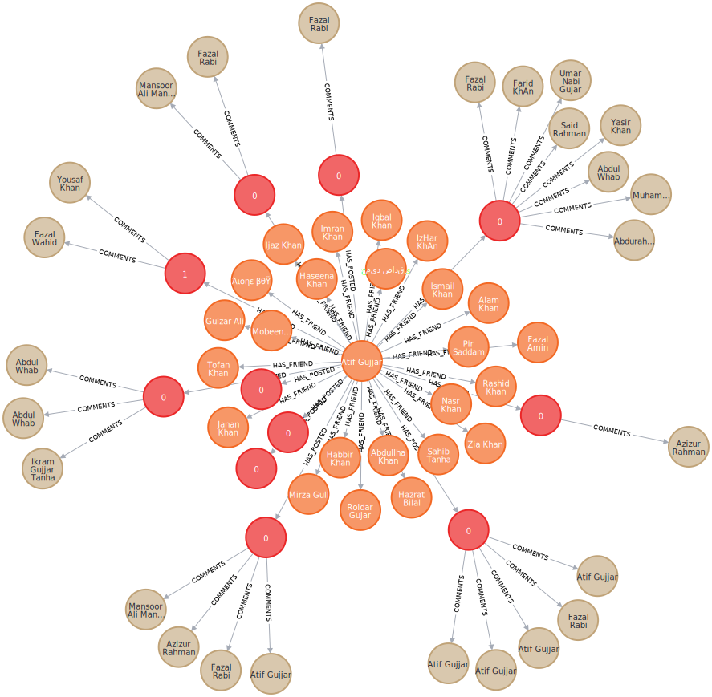
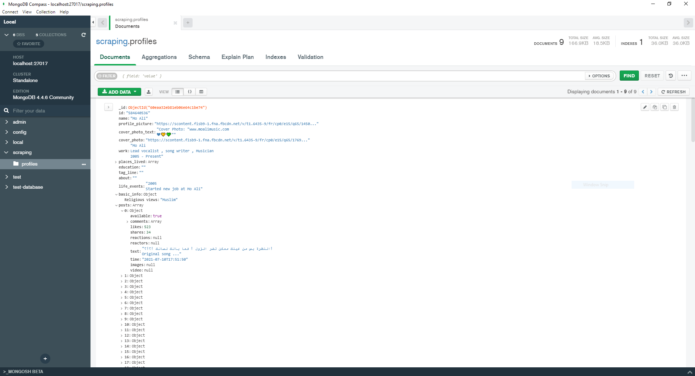

# Facebook Scraper

This tool scrapes Facebook account information and then stores the scraped data into a Neo4j and MongoDB database.

Currently, images and videos are not scraped directly. Rather, they can be obtained from the 'Posts' attribute of
scraped account. This attribute contains everything: Regular posts, any images and videos and other such information

## How to run

Use the following command to install the dependencies of this program

```shell
pip install -r requirements.txt
```

Then, start the program using

```shell
python main.py
```

Please see the parameters section to see how to customize this program. It is recommended that you use a VPN while
running this script in order to avoid IP bans. Finally, you must have an instance of Neo4j database running for which
you have provided DATABASE_URL. The program has been tested with Neo4j 4.2.5 and MongoDB 4.4.6.

## Cookies

It is to be noted that a cookies file must be provided for scraping to occur. The cookies can be obtained using a tool
such a [EditThisCookie](https://chrome.google.com/webstore/detail/editthiscookie/fngmhnnpilhplaeedifhccceomclgfbg?hl=en)
plugin for Chrome. You must paste the obtained cookies from a successful Facebook login attempt into the *cookies.json*
file. A default cookies.json is provided, but no guarantee is given about the validity of the cookies.

*You are encouraged to use cookies of your own as the default cookie may most likely may have gone stale*.

## Parameters

The parameters of program can be configured in the *config.py* file. The various parameters are

1. **NEO4J_DATABASE_URL**: The program uses the connection string provided in this parameter to connect to a Neo4j
   database.
2. **MONGO_DATABASE_URL**: Similar to, **NEO4J_DATABASE_URL**, but this string is used to connect to the MongoDB server
   instance.
3. **ROOT_NAME**: Is the starting profile for the scraper to scrape from. Can be an integer ID or string name such as
   razaq.chowdhary.1238.
4. **COOKIE_FILE**: Path to cookie file.
5. **PROXY**: Proxy for added anonymity.
6. **LOCAL_JSON_SAVE**: Path to a json file in which the result of scraping will be saved.
7. **NUM_PAGES_TO_SCRAPE**: This parameter is defines how many pages of posts will be scraped from a profile. More is
   better, but increases chances of the account in cookie getting banned.

## Considerations

The following points must be kept in mind.

1. Posts in this document refers to anything from images to actual posts a user has uploaded to Facebook.
2. Images/Videos can be extracted from posts, they are not placed separately.
3. This program relies upon [facebook-scraper](https://pypi.org/project/facebook-scraper/) module for extracting data.
   Any query about error or bugs may be directed towards the owner of that package.
4. Default cookie may have gone stale. This is indicated by strange 404s and exceptions. In this case, please generate a
   new cookie file as per the instructions in the cookies sections.

## Images/Visualization

The following is a visualization obtained from Neo4j desktop, and a screenshot from MongoDB Atlas regarding some
extracted data.



